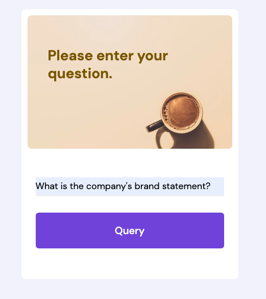
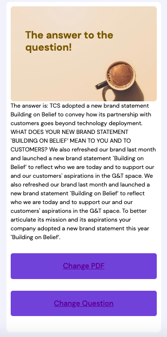

This repo builds a system to obtain extractive long form answers from Indian Annual Reports. Perceiving most previous usage, BERT has been used to get short answers with either a phrase or a sentence. With annual reports that is simply not sufficient and most queries require a more well-rounded answer. In this system, TF-IDF, FinBERT and BERT are used to build long answers from annual reports, or, in other words, a very large context. The BERT model here is pre-trained on unsupervised textual data from annual reports and fine-tuned on FiQA.

BERT was pre-trained on unlabelled annual report text and fine-tuned on the FiQA dataset.

This method suggests the annual report in pdf form is fed into pdfminer which converts the documents into text. This text is then split into sentences and the sentences with maximum similarity to the question are obtained. Finbert Embeddings are used to rerank them and the next top few answers are sent into pre-trained, fine-tuned BERT to process and rerank one last time. The BERT used can also be an already available fine-tuned question answering BERT from hugging face. The top candidates are then merged into an answer. 

Refer to the System flowchart to see a diagrammatic representation of the system.

The main notebook is "Extractive Long Form Question Answering System for Annual Reports using BERT" or can be accessed here: https://colab.research.google.com/drive/15n1fZauD1O96s-yrfsBaLIiIvs4HjUOX?usp=sharing 

If you do not have your own pre-trained and fine-tuned BERT you can use the already fine-tuned question answering BERT models on hugging face. They yield very good results. This notebook has the continuing code: https://colab.research.google.com/drive/1anJQmmGilFkVg4UksLyZNOKyRH5Vf2b1?usp=sharing or explore the notebook "Extractive Long Form Question Answering System for Annual Reports using BERT_Continuation(with RoBERTa)" in this repo. 

If you want to pre-train and fine-tune your model please visit this notebook. https://colab.research.google.com/drive/10QYn1F9AZUSiov9lqyxzjne41lvGHouV?usp=sharing or explore the notebook "BERT_Finetune_Pretrain" in this repo. 


You can also use the interactive app that is made with fastapi, HTML, CSS and uses uvicorn. Be sure to have the pdf of the annual report that you want to query in the same directory as main.py. You can install all necessary requirements with: 

```pip install -r requirements.txt```

Once you clone the repository and install requirements, run: 

```python main.py``` 

to start the app. 

 Have fun querying! 
 
 A sneak peek! 
 
 Home page: 
 


Put in your pdf name! 


The question you want to know the answer to: 



And finally the answer!


